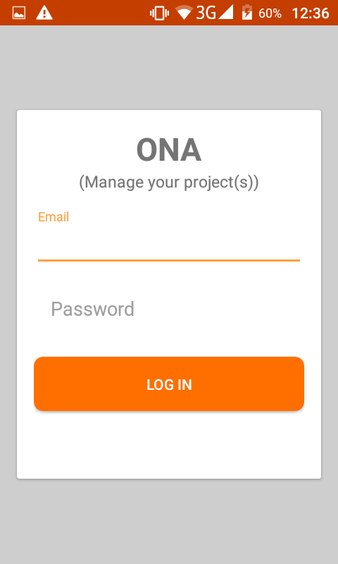
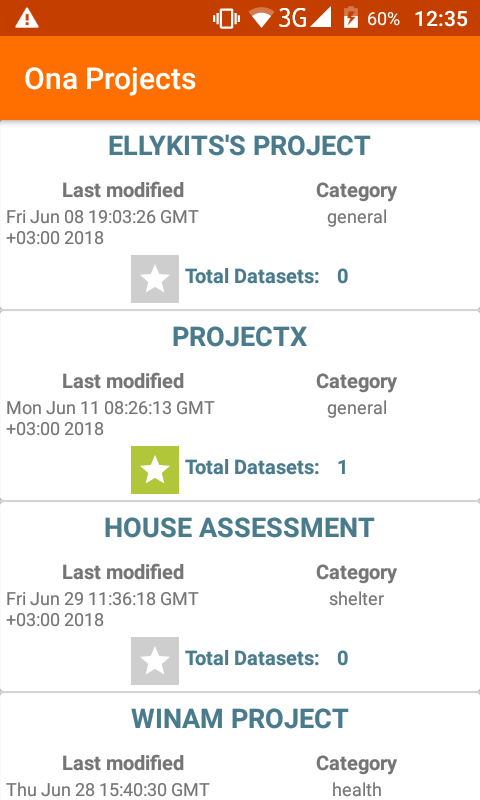
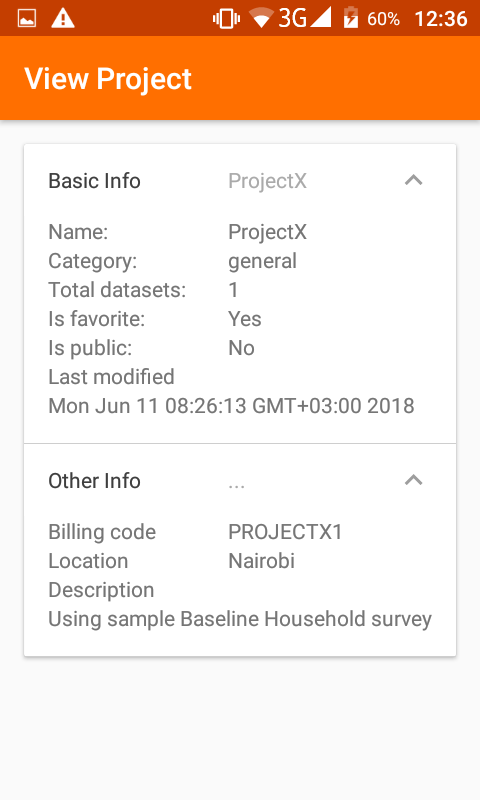

# ONA PROJECTS

A simple project that uses ONA Api to fetch and display projects
Follows Uncle Bobs CLEAN ARCHITECTURE and uses Android Architectural Components (AAC)

## Getting Started

Git clone or download zip file to continue
### Prerequisites

Android Studio 3.0 and and above

## Libraries used

* [Dagger2](https://github.com/google/dagger) - Android dependency management
* [Retrofit2](http://square.github.io/retrofit/) - For consuming REST API
* [Butterknife](http://jakewharton.github.io/butterknife/) - Binding view on android
* [Android Architectural Components](https://developer.android.com/topic/libraries/architecture/) - Used for architecturing app
* [RXJava2](https://github.com/ReactiveX/RxJava) -RxJava2 adapter for retrofit 

    
